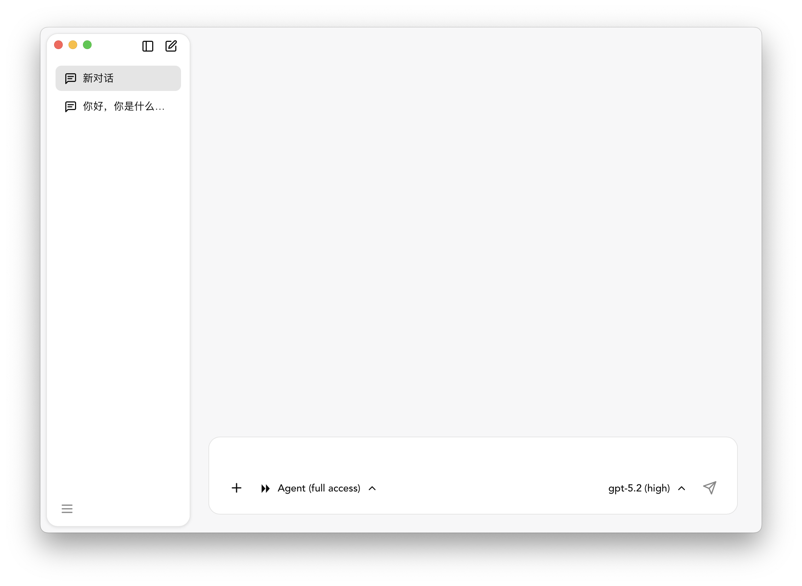

# Codex Desktop

基于 Tauri 2 构建的跨平台 AI 对话桌面应用。



## 概述

Codex Desktop 是一个原生桌面应用，通过 Tauri 将 React 前端与 Rust 后端结合，提供流畅的 AI 对话体验。支持多会话管理、代码高亮、Markdown 渲染等功能。

## 目标平台

- macOS
- Windows
- Linux

## 技术栈

### 前端

- React 19 + TypeScript
- Vite 7
- CSS Modules
- Storybook 10

### 后端

- Rust (2021 Edition)
- Tauri 2

## 快速开始

### 环境要求

- Node.js 18+
- Rust 1.70+ (MSRV: 1.70)
- 平台特定依赖（参考 [Tauri 官方文档](https://tauri.app/start/prerequisites/)）

### 安装依赖

```bash
npm install
```

### 开发模式

```bash
# 同时启动 Vite 和 Tauri
npm run tauri dev

# 仅前端开发服务器
npm run dev

# Storybook 组件开发
npm run storybook
```

### 构建

```bash
# TypeScript 编译检查
npm run build

# 构建生产版本
npm run tauri build
```

### 测试

```bash
npm run test
```

## 项目结构

```
codex-desktop/
├── src/                    # React 前端源码
│   ├── components/         # 组件
│   │   ├── ui/            # UI 基础组件
│   │   └── business/      # 业务组件
│   ├── api/               # Tauri invoke 封装
│   ├── hooks/             # 自定义 Hooks
│   ├── types/             # TypeScript 类型定义
│   └── utils/             # 工具函数
├── src-tauri/             # Rust/Tauri 后端
│   ├── src/               # Rust 源码
│   └── tauri.conf.json    # Tauri 配置
├── .storybook/            # Storybook 配置
└── docs/                  # 项目文档
```

## 推荐 IDE 配置

- [VS Code](https://code.visualstudio.com/)
- [Tauri 插件](https://marketplace.visualstudio.com/items?itemName=tauri-apps.tauri-vscode)
- [rust-analyzer](https://marketplace.visualstudio.com/items?itemName=rust-lang.rust-analyzer)

## License

MIT
