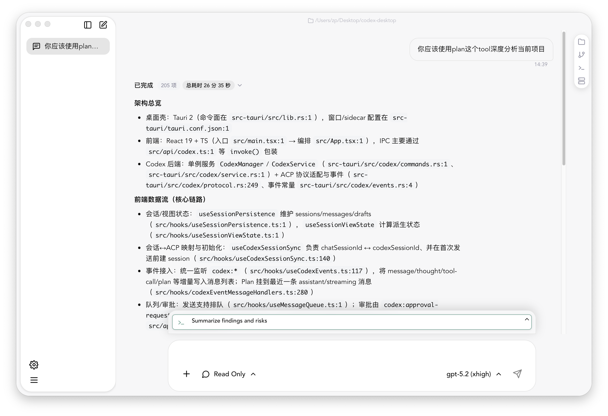

# Codex Desktop

基于 Tauri 2 构建的跨平台 AI 对话桌面应用。



> 本 README 侧重“如何跑起来 / 如何贡献 / 架构入口在哪里”。
> 具体用户可见功能的**当前实现**文档见 `docs/`（每篇都含限制、步骤、排障与实现指针）。

## 目录

- [概述](#概述)
- [目标平台](#目标平台)
- [技术栈](#技术栈)
- [架构与分层（读代码入口）](#architecture)
- [快速开始](#快速开始)
  - [环境要求](#环境要求)
  - [安装依赖](#安装依赖)
  - [开发模式](#开发模式)
  - [构建](#构建)
  - [测试](#测试)
  - [本地 CI 等价：Quality Gate](#quality-gate)
- [运行时与配置](#运行时与配置)
  - [Codex 目录（CODEX_HOME）](#codex-home)
  - [历史会话](#history-sessions)
  - [远程服务器与 remote:// 工作目录](#remote-workdir)
  - [Git 集成（当前实现）](#git-集成当前实现)
  - [设置面板（当前实现）](#设置面板当前实现)
- [项目结构](#项目结构)
- [排障（常见问题）](#排障常见问题)
- [贡献指南（Contributing）](#contributing)
- [发布（Release）](#release)
- [文档索引](#文档索引)
- [License](#license)

## 概述

Codex Desktop 是一个原生桌面应用，通过 Tauri 将 React 前端与 Rust 后端结合，提供流畅的 AI 对话体验。支持多会话管理、代码高亮、Markdown 渲染等功能。

## 目标平台

- macOS
- Windows
- Linux

## 技术栈

### 前端

- React 19 + TypeScript
- Vite 7
- CSS Modules
- Storybook 10

### 后端

- Rust (2021 Edition)
- Tauri 2

<a id="architecture"></a>

## 架构与分层（读代码入口）

这份仓库的核心分界线是：

- **前端（React）**：尽量保持平台无关；通过 `src/api/*`（`invoke()` 封装）+ `src/hooks/*`（事件订阅/状态机）与 Tauri 交互。
- **后端（Rust/Tauri）**：提供稳定的 command surface（即前端 `invoke('<command>')` 的契约），直接集成 `codex-core` 处理 AI 会话。

建议的阅读顺序：

1. **前端入口**：`src/main.tsx` → `src/App.tsx`
2. **后端入口**：`src-tauri/src/main.rs` → `src-tauri/src/lib.rs`（`generate_handler![...]` 注册命令）
3. **跨端边界**：`src/api/*`（前端请求） ↔ `src-tauri/src/*/commands.rs`（后端命令实现）
4. **事件**：`src-tauri/src/codex/events.rs`（`codex:*` 常量）+ `src/hooks/useCodexEvents.ts`（前端监听）

更多分层规则/边界约束见：

- 仓库索引：`AGENTS.md`
- 前端规则：`src/AGENTS.md`
- 后端规则：`src-tauri/AGENTS.md` 与 `src-tauri/src/AGENTS.md`

## 快速开始

### 环境要求

- Node.js 18+
- Rust 1.70+ (MSRV: 1.70)
- 平台特定依赖（参考 [Tauri 官方文档](https://tauri.app/start/prerequisites/)）

说明：CI 使用 Node 22.12（见 `.github/workflows/*`）。如果你本地版本差异较大，建议使用相近版本以减少环境差异。

### 安装依赖

```bash
npm install
```

### 开发模式

```bash
# 同时启动 Vite 和 Tauri
npm run tauri dev

# 仅前端开发服务器
npm run dev

# Storybook 组件开发
npm run storybook
```

说明：

- `tauri dev` 会先执行 `src-tauri/tauri.conf.json` 里的 `beforeDevCommand: "npm run dev"`。
- Vite 端口固定为 `1420` 且 `strictPort: true`（端口被占用会失败）。

### 构建

```bash
# TypeScript 编译检查
npm run build

# 构建生产版本
npm run tauri build
```

说明：

- `npm run build` = `tsc && vite build`（TypeScript 严格模式 + unused 检查会导致构建失败）。
- `npm run tauri build` 会构建完整的桌面应用。

### 测试

```bash
npm run test

# 单元测试
npm run test:unit
```

说明：

- 浏览器测试：Vitest browser + Playwright（CI 会安装 Chromium）。
- 单元测试：Vitest + happy-dom（见 `vitest.unit.config.ts`）。

<a id="quality-gate"></a>

### 本地 CI 等价：Quality Gate

提交前建议跑：

```bash
npm run quality:gate
```

它等价于 CI 的前端门禁（并额外做结构/包体检查），默认依次执行：

- `format`（Prettier check）
- `lint`（ESLint，**强制 `--max-warnings=0`，任何 warning 都会失败**）
- `build`（tsc + vite build）
- `coverage`（Vitest unit + 覆盖率阈值校验）
- `test`（Vitest browser + Playwright）
- `audit`（npm audit，高危以上）
- `size`（dist/assets gzip 体积限制：JS/CSS）
- `abstraction`（`src/` 下的 import depth / path depth / re-export-only / cycles 约束）

可通过环境变量配置/跳过（逗号分隔）：

```bash
# 例：只跳过 audit（比如内网 registry 不可用）
QUALITY_GATE_SKIP=audit npm run quality:gate
```

常见坑：如果跳过了 `build` 但没跳过 `size`，会因为缺少 `dist/assets` 而失败。

## 运行时与配置

<a id="codex-home"></a>

### Codex 目录（CODEX_HOME）

应用会读取/写入 Codex 配置目录（默认在用户目录下）。相关能力（读写 `~/.codex/**`）由 Tauri capability 配置授权（见 `src-tauri/capabilities/default.json`）。

<a id="history-sessions"></a>

### 历史会话

历史会话从 `~/.codex/sessions/` 目录中的 rollout 文件加载。

- 应用启动时显示空白新会话
- 侧边栏自动加载历史会话列表
- 点击历史会话会恢复完整的对话上下文

<a id="remote-workdir"></a>

### 远程服务器与 remote:// 工作目录

Codex Desktop 支持选择远程目录作为会话工作目录。

1. 在侧边栏的 “Remote Servers/远程服务器” 面板中添加服务器（仅支持 SSH Agent 或密钥文件认证）。
2. 点击顶部工作目录按钮，切换到 “远程” 标签页，选择服务器并浏览远程目录后确认。

更多细节（`~/.ssh/config` 解析、`remote://<server-id>/<path>` 规则、限制与排障）见：`docs/remote-servers.md`。

### Git 集成（当前实现）

- 后端通过系统 `git` CLI 执行命令，复用本机 Git 配置/SSH/GPG。
- 远程目录目前只支持**只读历史**：在远端通过 SSH 执行 `git log --all` 并解析。

细节与实现指针见：`docs/git.md`。

### 设置面板（当前实现）

- 前端会尝试调用后端 `get_settings` / `save_settings`；当前后端未实现时会自动回退到 localStorage（key：`codex-desktop-settings`）。
- 主题切换写入 `document.documentElement[data-theme]`；语言切换走 i18next。
- Web 预览环境下（无 Tauri runtime）本地文件读写、远程服务器列表等能力不可用。

细节与实现指针见：`docs/settings.md`。

## 项目结构

```
codex-desktop/
├── src/                    # React 前端源码
│   ├── components/         # 组件
│   │   ├── ui/            # UI 基础组件
│   │   └── business/      # 业务组件
│   ├── api/               # Tauri invoke 封装
│   ├── hooks/             # 自定义 Hooks
│   ├── types/             # TypeScript 类型定义
│   └── utils/             # 工具函数
├── src-tauri/             # Rust/Tauri 后端
│   ├── src/               # Rust 源码
│   └── tauri.conf.json    # Tauri 配置
├── .storybook/             # Storybook 配置
├── scripts/                # quality gate scripts
├── codex-upstream/         # git submodule（上游 codex-rs）
└── docs/                  # 项目文档
```

## 排障（常见问题）

### 1) `npm run tauri dev` 启动失败：端口被占用

Vite 端口固定 `1420` 且 `strictPort: true`。释放端口后重试。

### 2) 浏览器测试失败：Playwright 浏览器未安装

CI 会显式安装 Chromium。你本地可执行：

```bash
npx playwright install chromium
```

### 3) 远程服务器列表为空

当前实现只读取 `~/.ssh/config` 中**无通配符**的 `Host` 条目；应用内不持久化 add/remove。

详见：`docs/remote-servers.md`。

<a id="contributing"></a>

## 贡献指南（Contributing）

### 提交前自检

```bash
npm run format
npm run lint
npm run build
npm run test:unit
npm run test
npm run quality:gate
```

### 关键约束（会导致 CI 失败）

- TypeScript：`strict` + `noUnusedLocals/noUnusedParameters`（unused 会让 `tsc` 失败）。
- ESLint：quality gate 强制 `--max-warnings=0`，**任何 warning 都会失败**。
- 结构门禁：`src/` 下 import depth/path depth、re-export-only 数量、import cycle 会被 quality gate 拦截。

### 跨端边界规范

- **不要在组件里新增** `invoke()` / `@tauri-apps/api/event.listen()`：优先放到 `src/api/*` 与 `src/hooks/*`。
- 后端新增 command：实现放在对应 domain 的 `commands.rs`，并在 `src-tauri/src/lib.rs` `generate_handler![...]` 注册。

详细规则见：`AGENTS.md`、`src/AGENTS.md`、`src-tauri/src/AGENTS.md`。

<a id="release"></a>

## 发布（Release）

仓库提供 GitHub Actions 的 release build：

- 推送 tag `v*`（例如 `v1.2.3`）会触发构建并产出各平台安装包。
- 或在 Actions 手动触发 workflow 并填写 tag。

实现见：`.github/workflows/release-build.yml`。

## 文档

- Git 集成：`docs/git.md`
- 远程服务器：`docs/remote-servers.md`
- 设置面板：`docs/settings.md`

## 文档索引（面向开发者）

- 全局索引/约定与入口：`AGENTS.md`
- 前端架构边界：`src/AGENTS.md`
- 前端 invoke 封装规则：`src/api/AGENTS.md`
- 后端总览：`src-tauri/AGENTS.md`
- 后端命令/事件接入流程：`src-tauri/src/AGENTS.md`
- scripts（quality gate）：`scripts/AGENTS.md`
- Storybook 约定：`.storybook/AGENTS.md`

## 推荐 IDE 配置

- [VS Code](https://code.visualstudio.com/)
- [Tauri 插件](https://marketplace.visualstudio.com/items?itemName=tauri-apps.tauri-vscode)
- [rust-analyzer](https://marketplace.visualstudio.com/items?itemName=rust-lang.rust-analyzer)

## License

MIT
